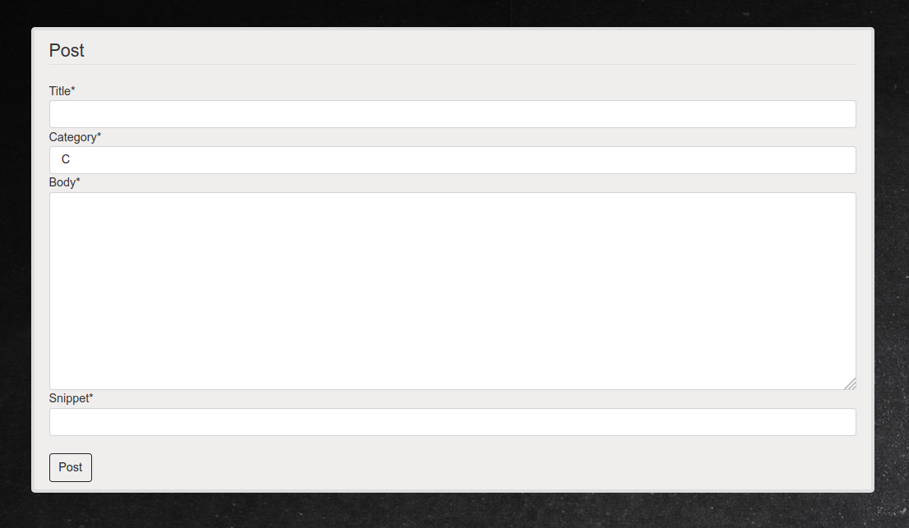

# Q/A Blog
When I first started college (I was studying Computer Science), Sometimes I had a lot of questions in my head, but most of the time I couldn't find anyone to ask them for help. Teachers were always busy so internet has been one of the best teachers I have ever had, It was a life saver when the questions in my head were driving me crazy :).

After thinking about it for a while, I thought it would be great if we in computer science department had a dedicated platform just for our students so they cab ask their question whenever they want,  and wait for others to answer them. 

So I started learning Django (a python web framework), Day by day I started to write a part of what was in my head. I finished it after a month and decide to share it with you all. It is not a professional website or even close but I learned a lot. I am still working on it in my spare time but feel free to modify however you want.

This project isn't great, but if you're deciding to use Django for the first time, it might at least give you an idea of what to do with back-end type websites. Let me explain to you what I did in this project

---

# How to run ?
To run the project on your local computer, you must first have python3 installed on your computer, however you also need pip (the standard package manager for [Python](https://www.python.org/))  because we need some packages to install first before to be able to run the project. I put all the required packages inside a file named 'requirements.txt', and for installing these packages all you need to do is to type the following command  and all packages will get installed automatically for you :

```python
> pip3 install -r requirements.txt
```

After installing the required packages, you should go to the directory where the 'manage.py' file is located and type the following command :

```python
> pyhton3 manage.py runserver
```

The above command will start the project and you will see a response similar to the following :

```
System check identified no issues (0 silenced).
November 28, 2021 - 13:00:18
Django version 3.1.4, using settings 'SoftSolution.settings'
Starting development server at http://127.0.0.1:8000/
Quit the server with CONTROL-C.
```

At this stage you can open your browser and type the address that has been given to you (http://127.0.0.1:8000/ here). When you first go to given address you will see  a home page :


 you can see on the main page, you can see all the previously asked questions. You can list the questions by category. You can search for questions by typing what you are looking for in the search box and all questions containing that search keyword will be returned and displayed to you.

You also can see a posted question for more information by clicking on the given links that you can see for every question.


When you click on a question, you are able to see the comments and answers to that question. You see 'like', 'dislike' and 'Add comment' buttons but You cannot do any of these unless you are an authorization member (until you login to the website).

If you don't have an account yet, you can register by clicking the 'Register' link in the toolbar at the top of the screen.


After registering, you will be automatically redirected to the login page where you can enter your username and password to log in.


When you log in,  you can now like and dislike questions, comments on questions, like and dislike people's comments. You can also ask your own questions by clicking  'Create Post' link in toolbar at top.



After you create your own post you are able to update or delete the post by opening the post and click on 'Update' and 'Delete' buttons.


When you register for the first time, a profile with default picture will get created for you. And after to in you can view your profile and add or update your first-name, last-name, user-name, email, bio, education-info, website, linkedin, facebook urls and also change the default profile picture.


Whether you are logged in or not, you can always view other users' profiles by clicking on their names  shown in posts.


And that's pretty much it. As I mentioned earlier, feel free to download the source code and modify it to your liking, It can be a guide to the ones that are starting new.
